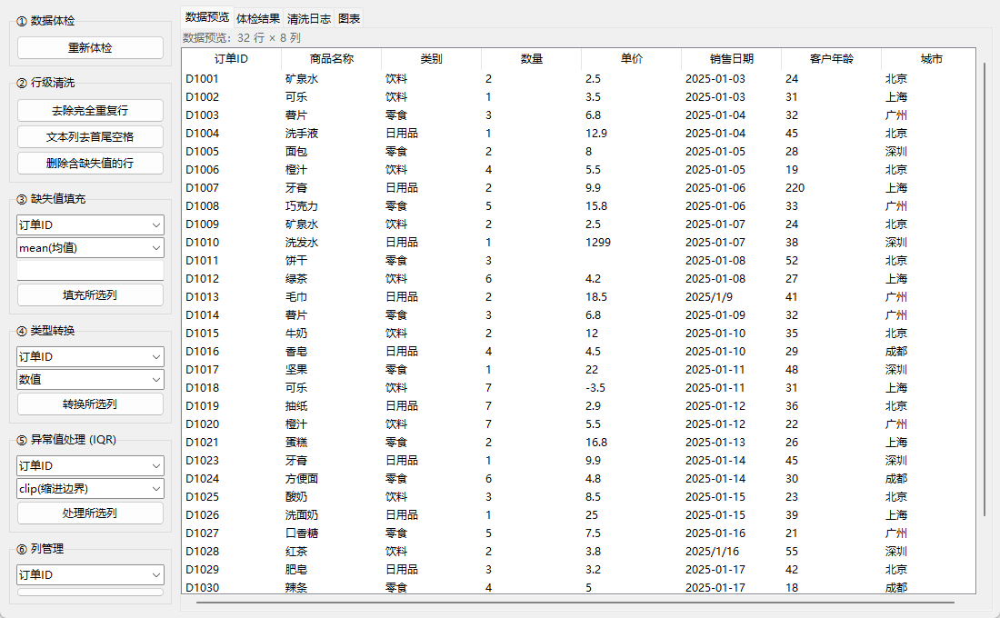

# CSV 数据清洗报表工具 — 项目报告

> 课程训练任务 2「AI 编程挑战」成果报告
> 配套文档：[AI使用说明.md](AI使用说明.md)（AI 协作全记录）｜[README.md](../README.md)（运行指南）



## 一、项目概述

### 1.1 目标

使用 AI 辅助完成一个小型编程项目，体验人机协作开发全流程。本项目选择 **数据工具** 方向，交付一个功能完整、可打包为 exe 双击运行的 CSV 数据清洗报表工具。

### 1.2 选题理由

- **功能闭环完整**：导入 → 体检 → 清洗 → 图表 → 导出，五个环节环环相扣，功能完成度（40%）上有充分的展示面
- **贴近真实场景**：拿到的 CSV 常有编码混乱、缺失值、货币符号文本、异常值等问题，本工具逐项解决，不是玩具 demo
- **工作量可控**：纯 Python 技术栈（pandas + Tkinter + matplotlib），无需前后端分离，适合小项目节奏
- **AI 协作友好**：需求边界清晰，AI 生成质量高，便于展示 AI 协作效率（30%）

### 1.3 交付物

| 交付物 | 位置 |
| --- | --- |
| 可运行的项目代码 | `src/`（含 19 个单元测试） |
| 打包后的可执行文件 | `dist/CsvCleaner.exe`（双击即用，免装 Python） |
| 项目报告（本文档） | `docs/项目报告.md` |
| AI 使用说明 | `docs/AI使用说明.md` |
| 示例脏数据 | `samples/messy_sales.csv`（UTF-8）、`messy_sales_gbk.csv`（GBK） |

## 二、功能实现

### 2.1 功能清单（全部实现）

| # | 功能 | 实现要点 |
| --- | --- | --- |
| 1 | CSV 导入 | chardet 自动识别 UTF-8/GBK；坏行跳过兜底，尽量打开文件 |
| 2 | 数据体检 | 重复行数、每列类型推断（数值/日期/文本）、缺失统计与缺失率、文本列"可转数值"识别、数值列 IQR 异常值计数 |
| 3 | 行级清洗 | 去完全重复行、删除缺失行、文本列去首尾空格 |
| 4 | 缺失值填充 | 均值 / 中位数 / 众数 / 固定值四种策略，按列选择 |
| 5 | 类型转换 | `¥1,299.00` 式货币文本自动去符号转数值；混合格式日期（`2025-01-03` 与 `2025/1/9`）统一解析 |
| 6 | 异常值处理 | IQR 法，支持"缩进边界"（clip）与"删除行"（remove）两种方式 |
| 7 | 列管理 | 重命名、删除列 |
| 8 | 统计图表 | 直方图、箱线图（标出异常值）、类别频次 TOP10 柱状图、数值列相关性热力图；中文字体适配 |
| 9 | 导出 CSV | UTF-8 带 BOM，Excel 双击打开不乱码 |
| 10 | 导出分析报告 | Markdown 格式，自动包含体检结果、完整清洗日志、统计摘要、数据预览 |
| 11 | 操作可追溯 | 每步清洗记录进「清洗日志」（步骤、说明、影响行数），并写入导出报告 |

### 2.2 演示数据的效果

自带样例 `messy_sales.csv`（34 行 × 8 列）预埋了 6 类典型问题：2 行完全重复、单价列货币文本（`¥12.90`、`1,299.00`）、日期格式混用、客户年龄缺失、年龄异常值 220、城市名带首尾空格。完成推荐操作序列后：32 行干净数据 + 全程操作日志 + 一键导出报告。

## 三、技术方案

### 3.1 架构

```
┌────────────────────────────────────────────┐
│  GUI 层 (gui/)          app.py             │
│  表格视图 / 图表面板     主窗口与事件        │
└──────────────────┬─────────────────────────┘
                   │ 调用
┌──────────────────▼─────────────────────────┐
│  核心逻辑层 (core/)   ← 单元测试直接覆盖     │
│  loader 编码读取   inspector 体检           │
│  cleaner 清洗+日志  stats 统计   report 报告 │
└────────────────────────────────────────────┘
```

核心设计：**逻辑与界面分离**。core 层不依赖任何 GUI，`Cleaner` 类包装 DataFrame 并维护操作日志，既被界面调用，也被单元测试与报告导出复用。

### 3.2 技术选型

| 选型 | 版本 | 理由 |
| --- | --- | --- |
| Python | 3.14 | 本机现有环境；打包链路经冒烟测试验证可用 |
| pandas | 3.0.5 | 数据处理事实标准 |
| Tkinter/ttk | 内置 | 零额外依赖，PyInstaller 打包支持成熟 |
| matplotlib | 3.11.1 | FigureCanvasTkAgg 可直接嵌入 Tkinter，图表类型全 |
| chardet | 7.6.0 | 中文 CSV 编码识别（GBK 场景刚需） |
| PyInstaller | 6.22.2 | 单文件 exe 打包，交付免安装 |

### 3.3 关键实现点

1. **编码自动识别**：读前 200KB 字节做 chardet 探测，GB2312/GBK/GB18030 统一放宽为 `gbk` 解码（覆盖更全），失败时降级"跳坏行 + 替换非法字节"
2. **清洗日志（可追溯性）**：`Cleaner` 每个操作调用 `_record()` 写入步骤号、操作名、参数说明、影响行数；界面「清洗日志」页实时显示，导出报告自动携带——清洗过程不黑箱
3. **货币文本转数值**：正则 `[¥$€£,\s]` 清洗后 `pd.to_numeric`，原本非空但转换失败的单元格保留为缺失（脏数据标记而非静默丢弃）
4. **IQR 异常值**：体检只计数、处理时才修改，两种动作（clip/remove）都记录影响行数
5. **打包细节**：`--onefile --windowed`；入口单独写 `launcher.py` 避免包内相对导入问题；`--paths src` 指定源码路径

## 四、测试与质量保证

- **单元测试**：19 个 pytest 用例，覆盖 loader（编码）、inspector（体检指标）、cleaner（8 类清洗操作 + 日志顺序）、stats、report（报告内容断言），全部通过
- **集成验证**：无头脚本驱动「打开文件 → 5 步清洗 → 全界面刷新」完整链路；真机启动截图确认布局与中文渲染
- **测试先行暴露的问题**：测试夹具中"重复行"不完全相同导致 3 个用例失败——修复夹具而非实现，验证了测试的有效性
- **开发期自纠的问题**：pack/grid 混用崩溃、GBK 样例 ¥ 符号不兼容、样例重复行订单号不同去重无效

## 五、AI 协作流程（摘要）

开发全程与 AI 编程助手协作完成，估计 **AI 产出占比约 85%~90%**：人工负责选题决策、约束定义、每阶段验收与纠偏；AI 负责代码、测试、打包与文档生成。完整过程记录（含每次问题的定位与修复）见 [AI使用说明.md](AI使用说明.md)。

关键协作经验：

1. **约束前置**：先定死界面形态与打包要求，AI 一次生成的方案即可用
2. **风险前置**：让 AI 先跑打包冒烟测试，再写业务代码
3. **验收在人**：测试全绿不代表数据正确，人工看数据、看界面才能发现"假重复行"这类问题

## 六、总结与改进方向

### 完成度自评

对照任务要求四步骤：① 选定项目（数据工具）✅；② AI 生成项目框架和核心代码 ✅（约 90% 代码由 AI 产出）；③ 手动调试优化并记录 AI 辅助比例 ✅（调试问题与比例见 AI 使用说明）；④ 项目文档与 AI 使用说明 ✅。

### 后续可扩展

- Excel (.xlsx) 支持（openpyxl）
- 清洗步骤撤销（当前只前滚不回滚）
- 报告导出 PDF / HTML 样式
- 列分布一览小图（体检页内嵌 sparkline）
